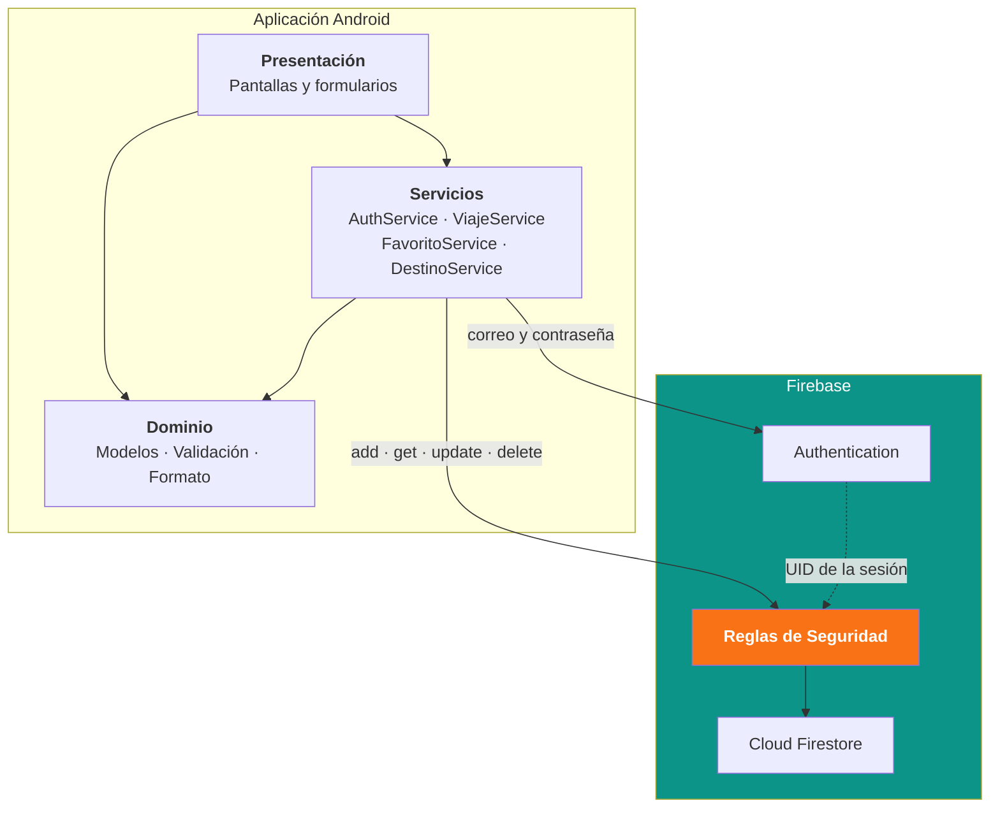

<div align="center">

# Travelia

**Asistente digital de viajes**

Centraliza itinerarios, presupuesto y lugares de interés en una sola aplicación,
con los datos sincronizados en la nube.

<br>


</div>

<br>

<div align="center">

**Universidad del Valle de México · UVM Online**
Soluciones de Programación Móvil · Actividad 8: Proyecto Integrador — Etapa 3

Eduardo Sebastián Sánchez Torres · Mtro. Franklin Leonardo Tapia Penagos
Ciudad de México, 19 de agosto de 2026

</div>

---

## Contenido

- [Sobre el proyecto](#sobre-el-proyecto)
- [Funcionalidades](#funcionalidades)
- [Arquitectura](#arquitectura)
- [Modelo de datos](#modelo-de-datos)
- [Operaciones CRUD](#operaciones-crud)
- [Seguridad](#seguridad)
- [Instalación](#instalación)
- [Stack tecnológico](#stack-tecnológico)

---

## Sobre el proyecto

Planificar un viaje obliga a consultar servicios distintos para vuelos,
hospedaje, transporte, actividades y restaurantes. Al quedar la información
dispersa, el viajero alterna constantemente entre aplicaciones, lo que alarga
la organización y dificulta el control de reservas e itinerarios.

Travelia reúne esa información en un solo lugar.

Este repositorio corresponde a la **tercera etapa** del Proyecto Integrador:

| Etapa | Alcance |
| :---: | :--- |
| 1 | Identificación de la problemática y definición de la propuesta |
| 2 | Selección de tecnologías y diseño de interfaces |
| **3** | **Construcción, integración con la nube y pruebas de seguridad** |

> **Objetivo de la etapa**
> Desarrollar la aplicación conforme a los diseños previos, implementando las
> operaciones básicas de un CRUD integradas con Cloud Firestore, y comprobar su
> comportamiento mediante pruebas estáticas y dinámicas de seguridad.

---

## Funcionalidades

| Módulo | Qué permite |
| :--- | :--- |
| **Autenticación** | Registro, inicio y cierre de sesión, recuperación de contraseña |
| **Viajes** | Alta, consulta en tiempo real con filtros por estado, edición y borrado |
| **Itinerario** | Actividades por fecha, hora, categoría y costo |
| **Explorador** | Búsqueda y filtrado del catálogo de destinos |
| **Favoritos** | Guardado y eliminación de lugares de interés |
| **Perfil** | Consulta y edición de nombre, idioma y moneda |
| **Interfaz** | Tema claro y oscuro, localización en español |

---

## Arquitectura



Las pantallas **nunca invocan directamente el SDK de Firebase**: siempre pasan
por la capa de servicios. Esto concentra el control de acceso en un solo lugar y
hace que las rutas se construyan siempre a partir del identificador de la sesión
activa, de modo que la aplicación no puede solicitar datos de otro usuario
aunque se manipule la interfaz.

```
travelia/
├── lib/
│   ├── models/      Entidades de dominio
│   ├── services/    Acceso a Firebase Authentication y Cloud Firestore
│   ├── screens/     Interfaces de usuario por módulo
│   ├── theme/       Identidad visual, temas claro y oscuro
│   └── utils/       Validación y formato
├── test/            Pruebas unitarias
└── android/         Configuración de compilación y firma
```

---

## Modelo de datos

```
users/{uid}                                   Perfil del usuario
  ├── viajes/{viajeId}                        CRUD principal
  │     └── actividades/{actividadId}         CRUD anidado
  └── favoritos/{favoritoId}                  Lugares guardados

destinos/{destinoId}                          Catálogo público, solo lectura
```

> Todos los datos personales cuelgan de `users/{uid}`, donde `uid` es el
> identificador que emite Firebase Authentication. Gracias a esa jerarquía, una
> sola condición aísla por completo la información de cada cuenta.

---

## Operaciones CRUD

La entidad principal es el **viaje**, almacenado en `users/{uid}/viajes`.

| Operación | Pantalla | Método de Firestore |
| :--- | :--- | :--- |
| **Agregar** | Nuevo viaje | `add()` |
| **Recuperar** | Mis viajes · Detalle | `snapshots()` y `get()` |
| **Actualizar** | Editar viaje | `update()` |
| **Eliminar** | Detalle del viaje | `delete()` en lote |

Se implementa además un CRUD anidado sobre las actividades del itinerario, en
`users/{uid}/viajes/{viajeId}/actividades`, y operaciones de alta, consulta y
baja sobre los lugares favoritos.

<details>
<summary><b>Por qué el borrado usa un lote atómico</b></summary>

<br>

Cloud Firestore no elimina las subcolecciones al borrar el documento que las
contiene. Un borrado directo dejaría las actividades del itinerario como
documentos huérfanos: invisibles desde la aplicación, pero presentes en la base
de datos y contabilizados para efectos de facturación.

Por eso la eliminación recoge primero las actividades asociadas, las marca para
eliminación y borra el viaje en la misma operación:

```dart
final actividades = await _actividades(id).get();
final lote = _db.batch();
for (final doc in actividades.docs) {
  lote.delete(doc.reference);
}
lote.delete(_viajes.doc(id));
await lote.commit();
```

</details>

---

## Seguridad

La protección de los datos no depende del cliente. Se aplica en tres capas:

| Capa | Responsabilidad |
| :--- | :--- |
| **Formulario** | Validación de formato y rangos antes de enviar |
| **Servicio** | Construye las rutas a partir del identificador de la sesión activa |
| **Reglas de Firestore** | Última palabra, del lado del servidor |

**Decisiones relevantes**

- Los errores de inicio de sesión se unifican en un mensaje genérico, para
  evitar la enumeración de usuarios.
- Las marcas de tiempo se generan con `FieldValue.serverTimestamp()`, es decir
  con el reloj del servidor y no con el del dispositivo, que es manipulable.
- La colección `destinos` es de solo lectura para el cliente.
- Una regla final de denegación por defecto cubre cualquier ruta no contemplada.
- La configuración de Firebase y las credenciales de firma no se versionan.

### Resultados de las pruebas

Se ejecutaron **10 pruebas estáticas y 12 dinámicas** sobre el APK de release y
sobre la aplicación en funcionamiento.

| Tipo | Herramientas | Resultado |
| :--- | :--- | :--- |
| Estáticas | MobSF 4.5.2, `flutter analyze`, `apkanalyzer`, `apksigner` | Sin hallazgos en código propio |
| Dinámicas | API REST de Cloud Firestore, mitmproxy | **12 / 12** con el comportamiento esperado |

<details>
<summary><b>Detalle de las pruebas estáticas</b></summary>

<br>

El análisis del código no arrojó errores ni advertencias, y las 16 pruebas
unitarias resultaron correctas.

Los hallazgos de severidad alta reportados por la herramienta se verificaron uno
a uno contra el manifiesto real del APK y resultaron **falsos positivos**,
originados en un fallo de lectura del `targetSdk`. Ninguno de los hallazgos de
código corresponde a código propio: todos provienen de bibliotecas de terceros.

Como resultado del análisis se aplicaron cuatro correcciones:

| Hallazgo | Corrección |
| :--- | :--- |
| El release se firmaba con la llave de depuración | Keystore propio RSA 4096 con SHA384 |
| Copia de seguridad habilitada | `allowBackup="false"` y reglas de extracción |
| Sin mitigación de secuestro de tareas | `taskAffinity=""` en `<application>` |
| Código legible dentro del APK | Minificación con R8 y ofuscación de Dart |

</details>

<details>
<summary><b>Detalle de las pruebas dinámicas</b></summary>

<br>

Se ejecutaron **contra la API REST de Cloud Firestore, sin pasar por la
aplicación**, empleando dos cuentas distintas para cruzar los accesos. La
decisión es deliberada: si el control de acceso dependiera de la interfaz,
bastaría con evitarla para saltárselo.

Se verificó que:

- Un usuario no puede leer ni escribir en el subárbol de otro.
- Los datos inválidos son rechazados por el servidor aunque se evite el
  formulario: presupuestos negativos, títulos fuera de longitud y estados fuera
  del catálogo permitido.
- Las rutas no declaradas quedan denegadas por defecto.
- La aplicación rechaza conexiones interceptadas por un proxy no confiable.

Un **control positivo** confirma que las reglas discriminan según el UID y no
bloquean de forma indiscriminada: el usuario sí puede escribir en su propio
subárbol.

El resultado final fue de 12 de 12 pruebas con el comportamiento esperado, tras
corregir un hallazgo detectado durante la primera ejecución.

</details>

---

## Instalación

> **Requisitos**
> Flutter 3.47 o superior · JDK 21 · Android SDK con API 36

La configuración del proyecto de Firebase no se versiona. Para compilar desde
cero:

**1. Preparar el proyecto en Firebase**

- Crear un proyecto con Authentication por correo y contraseña, y Cloud
  Firestore en modo producción.
- Registrar una aplicación Android con el paquete `com.uvm.travelia`.
- Colocar el archivo descargado en `travelia/android/app/google-services.json`.
- Generar `travelia/lib/firebase_options.dart` con `flutterfire configure`.
- Publicar las Reglas de Seguridad en la consola.

**2. Compilar y ejecutar**

```bash
cd travelia

flutter pub get                                  # dependencias
flutter test                                     # pruebas unitarias
flutter analyze                                  # análisis estático

flutter run                                      # ejecutar en depuración
flutter build apk --release \
  --obfuscate --split-debug-info=build/symbols   # APK de release
```

<details>
<summary><b>Nota sobre el espejo de Maven Central</b></summary>

<br>

`android/build.gradle.kts` consulta el espejo de Maven Central alojado por
Google antes que `mavenCentral()`.

Durante el desarrollo, `repo1.maven.org` entregaba los artefactos a unos
625 KB/s y en ocasiones dejaba la conexión abierta sin enviar datos, bloqueando
la compilación de forma indefinida. El espejo sirve el mismo contenido de forma
estable. Los tiempos de espera configurados en `android/gradle.properties`
evitan que una conexión inactiva vuelva a detener la compilación.

</details>

---

## Stack tecnológico

| Categoría | Tecnología | Versión |
| :--- | :--- | :--- |
| Framework | Flutter | 3.47.0 |
| Lenguaje | Dart | 3.13.0 |
| Base de datos | `cloud_firestore` | 6.8.0 |
| Autenticación | `firebase_auth` | 6.5.7 |
| Núcleo de Firebase | `firebase_core` | 4.13.0 |
| SDK de Android | Platform / Build-tools | API 36 / 36.0.0 |
| JDK | OpenJDK | 21 |
| Firma del APK | RSA 4096 con SHA384, esquema v2 | — |

---

<div align="center">

<sub>

**Nota sobre el uso de inteligencia artificial**

Durante el desarrollo se utilizó una herramienta de inteligencia artificial como
apoyo en la escritura de código, la configuración del entorno y la redacción de
la documentación. Las decisiones de fondo del proyecto —la problemática
abordada, la selección de tecnologías, el modelo de datos, el alcance de cada
etapa y el criterio para aceptar o desestimar cada hallazgo de seguridad—
corresponden al trabajo propio del autor. Los resultados de las herramientas
automatizadas fueron verificados de forma independiente antes de incorporarse a
este reporte.

</sub>

</div>
